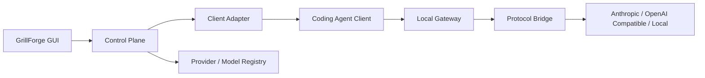

<p align="center">
  
</p>

<h1 align="center">GrillForge</h1>

<p align="center">
  面向 AI Coding Agent 的本地模型控制平面
</p>

<p align="center">
  <a href="./README.md">简体中文</a> · <a href="./README_EN.md">English</a>
</p>

<p align="center">
  
  
  
  
  
  
</p>

GrillForge 是一个本地优先、以 Coding Agent 客户端为入口的模型配置中心。它让多个 Coding Agent 共享同一套 Provider 与 Model Registry，同时由每个客户端的 Adapter 按其真实能力呈现模型槽位、模型池和 Agent 配置。

> [!IMPORTANT]
> GrillForge 不执行任务、不调度 Agent，也不运行 SubAgent。它只管理客户端配置、模型路由和协议转换；工具仍由对应的 Coding Agent 执行。

## 目录

- [为什么使用 GrillForge](#为什么使用-grillforge)
- [当前支持](#当前支持)
- [工作方式](#工作方式)
- [下载](#下载)
- [快速开始](#快速开始)
- [配置与安全](#配置与安全)
- [开发](#开发)
- [更新记录](./CHANGELOG.md)
- [后续计划](#后续计划)
- [项目结构](#项目结构)
- [贡献](#贡献)
- [许可证](#许可证)

## 为什么使用 GrillForge

- **以客户端为中心**：先选择 Claude Code、Codex、Pi、Kimi Code 等客户端，再配置该客户端真实支持的模型结构。
- **槽位独立选模**：同一个 Coding Agent 的不同槽位可分别选择不同的 Provider 与模型；GrillForge 会按客户端的真实能力呈现槽位，并保留 Codex 内置 SubAgent 必须与主模型同 Provider 等原生约束。
- **共享模型资产**：Provider 和 Model 只维护一次，可被多个客户端独立使用。
- **多协议桥接**：支持 Anthropic Messages、OpenAI Responses、OpenAI Chat Compatible 与 Gemini Native。
- **安全接管与恢复**：原子写入、单一恢复快照、配置差异检测和精确恢复。
- **失败即停止**：认证、配额、模型、Endpoint 或协议错误直接返回，不静默降级、不自动切换 Provider。
- **本地优先**：控制面与网关运行在本机；凭据不会通过 GUI 公共状态、默认日志或错误信息返回。

## 当前支持

### Coding Agent 客户端

| 客户端 | 当前支持的配置 | 状态 |
| --- | --- | --- |
| Claude Code | 默认模型、Sonnet / Opus / Fable / Haiku 槽位、原生 SubAgent、无限自定义 SubAgent | 已实现并完成真实 CLI 链路测试 |
| Claude Client | 对话 / Cowork 安全角色映射；Code 后台任务复用 Claude Code 配置 | 已实现并完成本地客户端链路测试 |
| Codex | 主模型、内置 SubAgent 默认模型、自定义 Agent 独立模型；支持独立 CLI 与 ChatGPT 内置 CLI | 已实现并完成真实 CLI 配置验收 |
| Pi | 默认模型与可用模型池 | 已实现并完成真实 CLI、鉴权与网关链路测试 |
| Kimi Code | Primary、Secondary、模型池，以及内置/全局永久 Agent 同步 | 已实现；配置与网关集成测试通过，真实 CLI E2E 待验证 |
| Gemini CLI | 默认模型 | 已实现 |
| Grok Build | 默认模型 | 已实现 |
| OpenCode | 默认模型与模型池 | 已实现 |
| OpenClaw | Primary 与有序 Fallback 模型池 | 已实现 |
| Hermes | 默认模型与模型池 | 已实现 |

客户端检测会依次检查应用 PATH、标准安装目录、NVM/fnm/Volta/asdf/mise/pnpm/Bun/npm 等动态目录，以及用户的交互式登录 Shell。存在多个同名 CLI 时会逐个执行 `--version`，忽略失效候选并使用第一个有效版本。每次进入“客户端”页面都会重新检测，无需重启 GrillForge。

### Provider 与协议

| 协议 | 能力 |
| --- | --- |
| Anthropic Messages | 原生请求、流式响应、工具调用、图片与 Thinking |
| OpenAI Responses | 请求/响应转换、SSE、工具调用、Reasoning、图片和文档 |
| OpenAI Chat Compatible | 请求/响应转换、SSE、工具调用、显式 Reasoning 字段与图片 |
| Gemini Native | Gemini CLI 直接配置，以及 Claude / Pi 入站请求到 Gemini 的流式与工具桥接 |
| 本地模型 | 支持无认证的 Loopback Endpoint，例如 Ollama 或本地兼容网关 |

Provider 页面提供 151 个从固定 cc-switch 版本生成并带客户端兼容信息的协议预设、自定义 Endpoint、API Key、自动/手动模型同步、模型导入与显式连接测试。对于 cc-switch 已定义官方查询端点的 Provider，可直接查询实时账户余额或 Coding Plan 套餐；GrillForge 不保存本地流量账本。协议转换代码只移植了当前产品真正使用并经过测试的 cc-switch 能力切片。

## 工作方式



- **Client Adapter** 负责客户端检测、读取状态、写入配置、安装 Skill，以及恢复接管前状态。
- **Provider Layer** 负责 Endpoint、认证方式与 API 协议。
- **Model Registry** 保存上游模型 ID、展示名称、任务能力和协议能力。
- **Local Gateway** 只做鉴权替换、模型路由和协议转换，不执行任何 Agent 工具。

## 下载

从 [GitHub Releases](https://github.com/liiiiwh/GrillForge/releases/latest) 下载 `GrillForge-v0.1.4-macos-universal.zip`。macOS 包同时支持 Apple Silicon 与 Intel，已使用 Developer ID Application 正式签名并通过 Apple Notarization；Release 同时提供 SHA-256 校验文件。

解压后将 `GrillForge.app` 移入“应用程序”即可。首次运行不需要绕过 Gatekeeper。

## 快速开始

### 环境要求

- Node.js 20.19+ 或 22.12+
- pnpm 10+
- Rust 1.85+ 与 Cargo
- 对应平台的 [Tauri 2 系统依赖](https://v2.tauri.app/start/prerequisites/)

### 从源码运行

```bash
git clone https://github.com/liiiiwh/GrillForge.git
cd GrillForge
pnpm install
pnpm tauri dev
```

### 使用流程

1. 在“供应商”页面选择预设或添加自定义 Provider。
2. 同步模型列表，或使用准确的上游 Model ID 手动添加模型。
3. 先执行连接测试，确认 Provider、Endpoint、凭据与模型有效。
4. 打开“客户端”，先选择 Provider，再选择模型或模型池。
5. 点击“应用配置”。多个客户端可以同时保存并独立应用。
6. 对于经本地网关工作的客户端，使用期间保持 GrillForge 运行。
7. GrillForge 启动时会在后台恢复已启用客户端的配置与路由；正常退出时恢复接管前配置。
8. 点击“停用”会关闭该客户端的持久启用状态，并精确恢复接管前配置。

## 配置与安全

GrillForge 的控制面数据默认位于：

```text
~/.grillforge/
├── config.yaml
├── models.yaml
├── agents.yaml
└── *.snapshot.json
```

- 配置文件按当前用户权限写入，凭据不会返回给前端公共状态。
- 写入采用原子替换；跨文件配置先完成验证，再整体提交。
- 每个 Adapter 只保留一份恢复快照，不创建无限备份。
- 配置差异只显示字段名或文件名，不显示凭据和配置值。
- GrillForge 不自动重试、自动降级或跨 Provider Fallback。
- 无认证 Provider 仅允许本机 Loopback 地址；远程 Endpoint 必须使用 HTTPS。

> [!WARNING]
> Claude Code 使用自定义 `ANTHROPIC_BASE_URL` 时，Claude Remote Control 和默认的 Optimistic Tool Search 可能不可用。停用 GrillForge 后会恢复原始配置。

## 开发

### 常用命令

```bash
# 前端构建
pnpm build

# 开发模式
pnpm tauri dev

# Rust 格式检查
cargo fmt --manifest-path src-tauri/Cargo.toml -- --check

# 完整测试
cargo test --manifest-path src-tauri/Cargo.toml --all-targets --all-features

# 严格静态检查
cargo clippy --manifest-path src-tauri/Cargo.toml \
  --all-targets --all-features -- -D warnings
```

### 可选真实链路测试

默认测试不会使用真实 API Key。真实 Provider 测试仅从进程环境读取凭据：

```bash
GRILLFORGE_LIVE_API_KEY='...' \
GRILLFORGE_LIVE_PROTOCOL=anthropic_messages \
GRILLFORGE_LIVE_ENDPOINT=https://api.example.com/anthropic \
GRILLFORGE_LIVE_MODEL=your-model-id \
GRILLFORGE_LIVE_API_KEY_PLACEMENT=bearer \
cargo test --manifest-path src-tauri/Cargo.toml \
  --test live_provider -- --ignored
```

不要把真实凭据写入源码、Fixture、Snapshot、命令历史或 CI 默认任务。

### macOS 打包

```bash
pnpm tauri build --target universal-apple-darwin --bundles app
```

产物位于：

```text
src-tauri/target/universal-apple-darwin/release/bundle/macos/GrillForge.app
```

macOS Universal（`arm64` + `x86_64`）发布包已通过 Developer ID Application 正式签名、Apple Notarization、ticket stapling 与 Gatekeeper 验证。Windows 路径和配置逻辑有自动化测试，但原生 Windows 安装包仍需在 Windows/MSVC 环境构建验证。

## 后续计划

- 使用真实 Kimi Code CLI 完成 Primary、Secondary 与持久 Agent 端到端验收。
- 在 Windows/MSVC 环境生成并验证原生安装包。
- 补充贡献指南、安全策略和正式 Release 自动化。

## 项目结构

```text
GrillForge/
├── src/                         # React GUI
├── src-tauri/src/
│   ├── adapters/                # Coding Agent Client Adapters
│   ├── bridge/                  # API 协议转换
│   ├── application.rs           # 控制面服务
│   ├── gateway.rs               # 本地模型网关
│   └── configuration.rs         # 配置事务与校验
├── src-tauri/tests/             # 集成、协议与真实链路测试
├── skills/                      # GrillForge Selector Skill
├── CONTEXT.md                   # 产品边界与领域语言
├── ARCHITECTURE.md              # 架构约束
└── LOGIC.md                     # 核心行为与不变量
```

## 贡献

欢迎通过 Issue 或 Pull Request 贡献。开始前请先阅读：

- [AGENTS.md](./AGENTS.md)：小而美、Fail Fast、TDD 等工程信条
- [CONTEXT.md](./CONTEXT.md)：产品定位与非目标
- [ARCHITECTURE.md](./ARCHITECTURE.md)：模块边界
- [LOGIC.md](./LOGIC.md)：配置与路由不变量

提交代码时请保持变更范围小、补充公开接口测试，并确保 `build`、`fmt`、`test` 与 `clippy` 全部通过。新增客户端必须基于真实安装、配置和运行链路，不接受只展示 UI 的空 Adapter。

## 致谢

- [cc-switch](https://github.com/farion1231/cc-switch)：Provider 预设、客户端处理方式和协议桥接的重要参考。移植代码保留其 MIT 归属与第三方声明。
- [Tauri](https://tauri.app/)、[React](https://react.dev/) 与 Rust 生态。
- 各 Coding Agent 项目及其公开配置规范。

第三方声明见 [THIRD_PARTY_LICENSES](./THIRD_PARTY_LICENSES/) 与 `src-tauri/src/bridge/LICENSE.cc-switch`。

## 许可证

GrillForge 基于 [MIT License](./LICENSE) 开源。第三方代码仍分别遵循其原始许可证。
