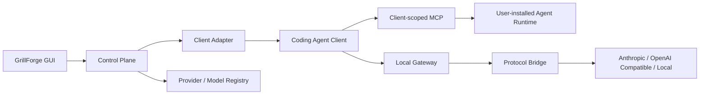

<p align="center">
  
</p>

<h1 align="center">GrillForge</h1>

<p align="center">
  让 Coding Agent 复用本机原生 Agent，并按任务调用不同模型
</p>

<p align="center">
  <a href="./README.md">简体中文</a> · <a href="./README_EN.md">English</a>
</p>

<p align="center">
  
  
  
  
  
</p>

GrillForge 是一个轻量、本地优先的多客户端模型与 SubAgent 控制平台：复用本机原生 Coding Agent CLI，让客户端之间可以共享 Agent，并按任务选择不同的 Provider 与模型。

> [!IMPORTANT]
> GrillForge 不实现 Agent Runtime、Agent Loop 或工作流引擎。它通过 MCP 做轻量级能力发现与任务转发，由用户电脑上已经安装的 Coding Agent CLI / Runtime 执行 Agent Loop 和工具；GrillForge 只负责客户端配置、SubAgent 授权以及 Provider / 模型路由。

## 核心能力

- **跨客户端调用原生 Agent**：同步本机 Claude Code、Codex、Pi、Kimi Code、OpenCode 等 Agent，通过客户端专属 MCP 授权给其他 Coding Agent 使用。
- **按场景选择模型**：编码、调研、评审、测试等扩展 SubAgent 可分别绑定来源 Agent、Provider 与模型。
- **灵活的模型槽位**：按客户端真实能力配置默认模型、角色模型、SubAgent 默认模型、自定义 Agent 和模型池；同一客户端的不同槽位可使用不同 Provider。
- **复用原生 Runtime**：Agent Loop、工具和上下文仍由用户已安装的 CLI / Runtime 执行；GrillForge 不实现 Agent Runtime 或工作流引擎。
- **本地模型控制层**：统一 Provider / Model Registry，桥接 Anthropic、OpenAI Responses、OpenAI Chat 与 Gemini 协议；配置原子写入、失败即停止。

## 当前支持

### Coding Agent 客户端

| 客户端 | 当前支持的配置 | 状态 |
| --- | --- | --- |
| Claude Code | 默认模型、Sonnet / Opus / Fable / Haiku、原生 SubAgent 默认模型槽位；可使用扩展 SubAgent MCP | 已实现并完成真实 CLI 与本地 Agent 工具循环测试 |
| Claude Client | 对话 / Cowork 安全角色映射；1P / 3P 均可独立使用扩展 SubAgent MCP | 已实现并完成本机配置链路测试 |
| Codex | 主模型、内置 SubAgent 默认模型、自定义 Agent 独立模型；支持独立 CLI 与 ChatGPT 内置 CLI | 已实现并完成真实 CLI 配置验收 |
| Pi | 默认模型、可用模型池；通过社区 `pi-mcp-extension` 使用扩展 SubAgent | 已实现并完成真实 CLI、扩展安装、鉴权与网关链路测试 |
| Kimi Code | 默认模型、SubAgent 模型池，以及 `agent` / `coder` / `explore` / `plan` 和自定义 Agent | 已实现；使用当前 `~/.kimi-code/config.toml`、`mcp.json` 与 Agent 目录结构 |
| Gemini CLI | 默认模型；内建与本机自定义 Agent 可作为扩展 SubAgent | 已实现，并使用官方 CLI 0.55.1 验证精确 Agent 调用与隔离模型路由 |
| Grok Build | 默认模型；可将 `inspect --json` 返回的本机 Agent 用作扩展 SubAgent | 已实现，并使用官方 CLI 1.0.3 验证精确 Agent 调用与隔离模型路由 |
| OpenCode | 默认模型、模型池；内建与本机自定义 SubAgent 可作为扩展 SubAgent | 已实现，并完成官方 CLI 精确 SubAgent 调用与隔离模型路由测试 |
| Hermes | 默认模型与模型池 | 已实现 |

客户端检测覆盖 PATH、标准安装目录和常见 Node 版本管理器；存在多个同名 CLI 时逐个验证并使用第一个有效版本。进入“客户端”页面会在后台刷新状态。

### Provider 与协议

| 协议 | 能力 |
| --- | --- |
| Anthropic Messages | 原生请求、流式响应、工具调用、图片与 Thinking |
| OpenAI Responses | 请求/响应转换、SSE、工具调用、Reasoning、图片和文档 |
| OpenAI Chat Compatible | 请求/响应转换、SSE、工具调用、显式 Reasoning 字段与图片 |
| Gemini Native | Gemini CLI 直接配置，以及四类入站协议到 Gemini 的文本、流式与工具桥接 |
| 本地模型 | 支持无认证的 Loopback Endpoint，例如 Ollama 或本地兼容网关 |

Provider 页面提供协议预设、自定义 Endpoint、API Key、自动/手动模型同步与连接测试。模型同步会探测模型实际支持的协议；模型只要原生支持 Anthropic、Responses、Chat 或 Gemini 中任一种，四类客户端入口都可使用：协议一致时直连，否则桥接文本、流式响应与工具调用。支持的 Provider 可查询实时余额或 Coding Plan，GrillForge 不保存本地流量账本。

## 工作方式



- **Client Adapter** 负责客户端检测、读取状态、写入配置、安装必要的客户端扩展，以及恢复接管前状态。
- **Provider Layer** 负责 Endpoint、认证方式与 API 协议。
- **Model Registry** 保存上游模型 ID、展示名称、任务能力和协议能力。
- **Local Gateway** 只做鉴权替换、模型路由和协议转换，不执行任何 Agent 工具。

扩展调用链路：`主 Agent → GrillForge MCP → 扩展 SubAgent → 本机原生 CLI / Runtime → Provider 模型`。

## 下载

从 [GitHub Releases](https://github.com/liiiiwh/GrillForge/releases/latest) 下载。

## 快速开始

### 环境要求

- Node.js 20.19+ 或 22.12+
- pnpm 10+
- Rust 1.85+ 与 Cargo
- 对应平台的 [Tauri 2 系统依赖](https://v2.tauri.app/start/prerequisites/)

### 从源码运行

```bash
git clone https://github.com/liiiiwh/GrillForge.git
cd GrillForge
pnpm install
pnpm tauri dev
```

### 使用流程

1. 在“供应商”页面选择预设或添加自定义 Provider。
2. 同步模型列表，或使用准确的上游 Model ID 手动添加模型。
3. 先执行连接测试，确认 Provider、Endpoint、凭据与模型有效。
4. 打开“客户端”，先选择 Provider，再选择模型或模型池。
5. 点击“应用配置”。多个客户端可以同时保存并独立应用。
6. 经本地网关工作的客户端在使用期间需要保持 GrillForge 运行；停用时会恢复接管前配置。

### 扩展 SubAgent

1. 在“扩展 SubAgent”页面同步并选择本机 Agent。
2. 可选择跟随来源 Agent 原生模型，或绑定一个 GrillForge 模型。
3. 在目标客户端页面挂载客户端专属 MCP，再开启允许该客户端使用的扩展 SubAgent。绑定变化会实时更新已挂载 MCP 的 Agent 列表；关闭全部绑定不会自动卸载 MCP。
4. `run_agent` 等待本机 Agent 完成，支持时在工具卡显示不含任务内容的简短 MCP 进度，结束后只返回一次最终结果；无需轮询，工作流可并发调用多个扩展 SubAgent，单次任务上限为三小时。
5. Pi 通过社区 `pi-mcp-extension` 接入；GrillForge 可在用户确认后安装固定版本。

模型配置、MCP 挂载和扩展 SubAgent 绑定彼此独立。MCP 只暴露固定的 Agent 列表与调用入口；实际 Agent Loop 和工具始终由来源客户端的本机 Runtime 执行。

## 配置与安全

GrillForge 的控制面数据默认位于：

```text
~/.grillforge/
├── config.yaml
├── models.yaml
├── agents.yaml
└── *.snapshot.json
```

- 配置文件按当前用户权限写入，凭据不会返回给前端公共状态。
- 写入采用原子替换；跨文件配置先完成验证，再整体提交。
- 每个 Adapter 只保留一份恢复快照，不创建无限备份。
- 配置差异只显示字段名或文件名，不显示凭据和配置值。
- GrillForge 不自动重试、自动降级或跨 Provider Fallback。
- 无认证 Provider 仅允许本机 Loopback 地址；远程 Endpoint 必须使用 HTTPS。

> [!WARNING]
> Claude Code 使用自定义 `ANTHROPIC_BASE_URL` 时，Claude Remote Control 和默认的 Optimistic Tool Search 可能不可用。停用 GrillForge 后会恢复原始配置。

> [!NOTE]
> `pi-mcp-extension` 是社区扩展，拥有与其他 Pi 扩展相同的本机进程权限。GrillForge 不会静默安装；只有用户确认后才调用当前检测到的有效 Pi CLI。安装源固定为 `npm:pi-mcp-extension@1.5.0`。

## 开发

### 常用命令

```bash
# 前端构建
pnpm build

# 开发模式
pnpm tauri dev

# Rust 格式检查
cargo fmt --manifest-path src-tauri/Cargo.toml -- --check

# 完整测试
cargo test --manifest-path src-tauri/Cargo.toml --all-targets --all-features

# 严格静态检查
cargo clippy --manifest-path src-tauri/Cargo.toml \
  --all-targets --all-features -- -D warnings
```

### 可选真实链路测试

默认测试不会使用真实 API Key。真实 Provider 测试仅从进程环境读取凭据：

```bash
GRILLFORGE_LIVE_API_KEY='...' \
GRILLFORGE_LIVE_PROTOCOL=anthropic_messages \
GRILLFORGE_LIVE_ENDPOINT=https://api.example.com/anthropic \
GRILLFORGE_LIVE_MODEL=your-model-id \
GRILLFORGE_LIVE_API_KEY_PLACEMENT=bearer \
cargo test --manifest-path src-tauri/Cargo.toml \
  --test live_provider -- --ignored
```

不要把真实凭据写入源码、Fixture、Snapshot、命令历史或 CI 默认任务。

### macOS 打包

```bash
pnpm tauri build --target universal-apple-darwin --bundles app
```

产物位于：

```text
src-tauri/target/universal-apple-darwin/release/bundle/macos/GrillForge.app
```

## 贡献

欢迎通过 Issue 或 Pull Request 贡献。开始前请先阅读：

- [AGENTS.md](./AGENTS.md)：小而美、Fail Fast、TDD 等工程信条
- [CONTEXT.md](./CONTEXT.md)：产品定位与非目标
- [ARCHITECTURE.md](./ARCHITECTURE.md)：模块边界
- [LOGIC.md](./LOGIC.md)：配置与路由不变量

提交代码时请保持变更范围小、补充公开接口测试，并确保 `build`、`fmt`、`test` 与 `clippy` 全部通过。新增客户端必须基于真实安装、配置和运行链路，不接受只展示 UI 的空 Adapter。

## 致谢

- [cc-switch](https://github.com/farion1231/cc-switch)：Provider 预设、客户端处理方式和协议桥接的重要参考。移植代码保留其 MIT 归属与第三方声明。
- [Tauri](https://tauri.app/)、[React](https://react.dev/) 与 Rust 生态。
- 各 Coding Agent 项目及其公开配置规范。

第三方声明见 [THIRD_PARTY_LICENSES](./THIRD_PARTY_LICENSES/) 与 `src-tauri/src/bridge/LICENSE.cc-switch`。

## 许可证

GrillForge 基于 [MIT License](./LICENSE) 开源。第三方代码仍分别遵循其原始许可证。
