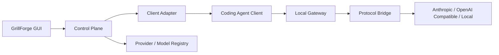

<p align="center">
  
</p>

<h1 align="center">GrillForge</h1>

<p align="center">
  A local model control plane for AI coding agents
</p>

<p align="center">
  <a href="./README.md">简体中文</a> · <a href="./README_EN.md">English</a>
</p>

<p align="center">
  
  
  
  
  
  
</p>

GrillForge is a local-first, client-centric model configuration center for coding agents. Multiple coding agents share one Provider and Model Registry, while each client adapter exposes only the model slots, pools, and agent settings that the real client supports.

> [!IMPORTANT]
> GrillForge does not execute tasks, schedule agents, or run SubAgents. It manages client configuration, model routing, and protocol translation. Tools are still executed by the corresponding coding agent.

## Table of Contents

- [Why GrillForge](#why-grillforge)
- [Current Support](#current-support)
- [How It Works](#how-it-works)
- [Quick Start](#quick-start)
- [Configuration and Security](#configuration-and-security)
- [Development](#development)
- [Changelog](./CHANGELOG.md)
- [Before the First Public Release](#before-the-first-public-release)
- [Repository Layout](#repository-layout)
- [Contributing](#contributing)
- [License](#license)

## Why GrillForge

- **Client-centric configuration**: choose Claude Code, Codex, Pi, Kimi Code, or another supported client first, then configure its real model shape.
- **Shared model assets**: maintain Providers and Models once and reuse them independently across clients.
- **Multi-protocol bridges**: Anthropic Messages, OpenAI Responses, OpenAI Chat Compatible, and Gemini Native.
- **Safe takeover and restore**: atomic writes, one recovery snapshot, configuration difference reporting, and exact restoration.
- **Fail fast**: authentication, quota, model, endpoint, and protocol errors are returned directly—without silent downgrade or Provider switching.
- **Local first**: the control plane and gateway run locally; credentials are never returned through public GUI state, default logs, or error messages.

## Current Support

### Coding Agent Clients

| Client | Supported configuration | Status |
| --- | --- | --- |
| Claude Code | Default model, Sonnet / Opus / Fable / Haiku slots, native SubAgent, unlimited named SubAgents | Implemented and verified through a real CLI chain |
| Claude Client | Safe conversation / Cowork role routes; Code background tasks reuse Claude Code configuration | Implemented and locally verified |
| Codex | Main model, built-in SubAgent default, and per-custom-Agent models; standalone and ChatGPT-bundled CLI support | Implemented and verified with real CLI configuration |
| Pi | Default model and available model pool | Implemented with real CLI, authentication, and gateway verification |
| Kimi Code | Primary, Secondary, model pool, and built-in/global persistent Agent discovery | Implemented; configuration and gateway integration tests pass, real CLI E2E pending |
| Gemini CLI | Default model | Implemented |
| Grok Build | Default model | Implemented |
| OpenCode | Default model and model pool | Implemented |
| OpenClaw | Primary model and ordered fallback pool | Implemented |
| Hermes | Default model and model pool | Implemented |

Client discovery checks the application PATH, standard installation locations, dynamic NVM/Volta/asdf/mise/pnpm/Bun/npm paths, and the user's login shell. A candidate is shown as installed only after its real `--version` command succeeds. Opening the Clients page always refreshes discovery, so GrillForge does not need to be restarted after installing a CLI.

### Providers and Protocols

| Protocol | Capabilities |
| --- | --- |
| Anthropic Messages | Native requests, streaming, tool calls, images, and Thinking |
| OpenAI Responses | Request/response translation, SSE, tools, Reasoning, images, and documents |
| OpenAI Chat Compatible | Request/response translation, SSE, tools, explicit reasoning fields, and images |
| Gemini Native | Direct Gemini CLI configuration plus streaming/tool translation from Claude and Pi inbound requests |
| Local models | Unauthenticated loopback endpoints such as Ollama or a local compatible gateway |

The Provider page includes 151 protocol presets generated from a fixed cc-switch revision with per-client compatibility metadata, custom endpoints, API keys, automatic/manual model sync, model import, and explicit connection tests. Providers with vetted cc-switch endpoints can query live account balances or Coding Plan quotas; GrillForge does not keep a local traffic ledger. Only tested cc-switch capability slices used by the product are ported.

## How It Works



- **Client Adapter** detects a client, reads state, writes configuration, installs a Skill where applicable, and restores the pre-takeover state.
- **Provider Layer** owns endpoints, authentication placement, and API protocols.
- **Model Registry** stores upstream model IDs, display names, task capabilities, and transport capabilities.
- **Local Gateway** performs authentication replacement, model routing, and protocol translation. It never executes agent tools.

## Quick Start

### Prerequisites

- Node.js 20.19+ or 22.12+
- pnpm 10+
- Rust 1.85+ and Cargo
- The [Tauri 2 system prerequisites](https://v2.tauri.app/start/prerequisites/) for your platform

### Run from Source

```bash
git clone https://github.com/liiiiwh/GrillForge.git
cd GrillForge
pnpm install
pnpm tauri dev
```

### Basic Workflow

1. Choose a preset or add a custom Provider on the Providers page.
2. Sync the model list, or manually add a model with its exact upstream model ID.
3. Run a connection test to validate the Provider, endpoint, credential, and model.
4. Open Clients, choose a Provider first, then choose the model or model pool.
5. Apply the configuration. Multiple clients can be saved and applied independently.
6. Keep GrillForge running while a gateway-backed client is in use.
7. On launch, GrillForge restores enabled client configuration and routes in the background; a normal quit restores the pre-takeover files.
8. Disabling a client clears its persistent enabled state and restores the exact pre-takeover configuration.

## Configuration and Security

Control-plane data is stored under:

```text
~/.grillforge/
├── config.yaml
├── models.yaml
├── agents.yaml
└── *.snapshot.json
```

- Configuration files are written with user-only permissions; credentials are excluded from public frontend state.
- Writes use atomic replacement. Multi-file configuration is fully validated before commit.
- Each adapter keeps one recovery snapshot rather than an unbounded backup history.
- Difference reports contain only field or file names—not credentials or configuration values.
- GrillForge does not automatically retry, downgrade protocols, or fall back across Providers.
- Unauthenticated Providers are restricted to loopback addresses; remote endpoints require HTTPS.

> [!WARNING]
> A custom `ANTHROPIC_BASE_URL` can disable Claude Remote Control and default Optimistic Tool Search. Disabling GrillForge restores the original Claude configuration.

## Development

### Common Commands

```bash
# Frontend build
pnpm build

# Development app
pnpm tauri dev

# Rust formatting
cargo fmt --manifest-path src-tauri/Cargo.toml -- --check

# Complete test suite
cargo test --manifest-path src-tauri/Cargo.toml --all-targets --all-features

# Strict linting
cargo clippy --manifest-path src-tauri/Cargo.toml \
  --all-targets --all-features -- -D warnings
```

### Optional Live Route Test

Default tests never use a real API key. Live Provider tests read credentials only from the process environment:

```bash
GRILLFORGE_LIVE_API_KEY='...' \
GRILLFORGE_LIVE_PROTOCOL=anthropic_messages \
GRILLFORGE_LIVE_ENDPOINT=https://api.example.com/anthropic \
GRILLFORGE_LIVE_MODEL=your-model-id \
GRILLFORGE_LIVE_API_KEY_PLACEMENT=bearer \
cargo test --manifest-path src-tauri/Cargo.toml \
  --test live_provider -- --ignored
```

Never place real credentials in source files, fixtures, snapshots, shell history, or default CI jobs.

### macOS Packaging

```bash
pnpm tauri build --target universal-apple-darwin --bundles app
```

The bundle is written to:

```text
src-tauri/target/universal-apple-darwin/release/bundle/macos/GrillForge.app
```

The macOS Universal (`arm64` + `x86_64`) build and Developer ID Application signature are verified. The public archive will be published after Apple notarization completes. Windows paths and configuration behavior are covered by automated tests, but a native Windows installer must still be built and verified in a Windows/MSVC environment.

## Before the First Public Release

- Complete a real Kimi Code CLI end-to-end run covering Primary, Secondary, and persistent Agents.
- Build and verify a native installer in a Windows/MSVC environment.
- Complete Apple notarization for the macOS release archive.
- Add a contribution guide, security policy, and release automation.

## Repository Layout

```text
GrillForge/
├── src/                         # React GUI
├── src-tauri/src/
│   ├── adapters/                # Coding Agent Client adapters
│   ├── bridge/                  # API protocol bridges
│   ├── application.rs           # Control-plane service
│   ├── gateway.rs               # Local model gateway
│   └── configuration.rs         # Configuration transactions and validation
├── src-tauri/tests/             # Integration, protocol, and live-route tests
├── skills/                      # GrillForge selector Skill
├── CONTEXT.md                   # Product boundaries and domain language
├── ARCHITECTURE.md              # Architecture constraints
├── LOGIC.md                     # Core behavior and invariants
└── MVP_PLAN.md                  # MVP acceptance plan
```

## Contributing

Issues and pull requests are welcome. Before contributing, read:

- [AGENTS.md](./AGENTS.md) for the Small and Beautiful, Fail Fast, and TDD engineering creed
- [CONTEXT.md](./CONTEXT.md) for product scope and non-goals
- [ARCHITECTURE.md](./ARCHITECTURE.md) for module boundaries
- [LOGIC.md](./LOGIC.md) for configuration and routing invariants

Keep changes narrow, add tests at public boundaries, and ensure `build`, `fmt`, `test`, and `clippy` all pass. A new client must be backed by its real installation, configuration, and runtime path; UI-only placeholder adapters are not accepted.

### Contributors

- `1742312272@qq.com` — project maintenance and releases
- OpenAI Codex — architecture, implementation, and test collaboration

## Acknowledgements

- [cc-switch](https://github.com/farion1231/cc-switch) for important references covering Provider presets, client behavior, and protocol bridges. Ported code retains its MIT attribution and third-party notices.
- [Tauri](https://tauri.app/), [React](https://react.dev/), and the Rust ecosystem.
- The coding-agent projects and their public configuration specifications.

See [THIRD_PARTY_LICENSES](./THIRD_PARTY_LICENSES/) and `src-tauri/src/bridge/LICENSE.cc-switch` for third-party notices.

## License

GrillForge is open source under the [MIT License](./LICENSE). Third-party code remains governed by its original licenses.
