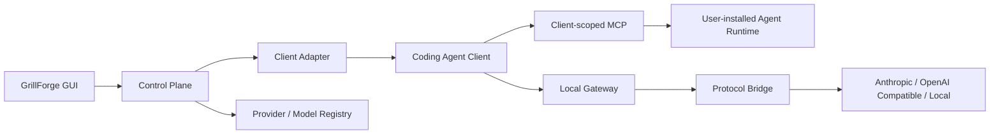

<p align="center">
  
</p>

<h1 align="center">GrillForge</h1>

<p align="center">
  Let coding agents reuse local native agents and choose models per task
</p>

<p align="center">
  <a href="./README.md">简体中文</a> · <a href="./README_EN.md">English</a>
</p>

<p align="center">
  
  
  
  
  
</p>

GrillForge is a lightweight, local-first model and SubAgent control plane for multiple coding clients. It reuses native coding-agent CLIs, lets clients share local Agents, and selects different Providers and models per task.

> [!IMPORTANT]
> GrillForge does not implement an Agent Runtime, Agent Loop, or workflow engine. MCP provides lightweight discovery and task forwarding; the coding-agent CLI / Runtime already installed on the user's machine still owns the Agent Loop and tools. GrillForge only manages client configuration, SubAgent authorization, and Provider/model routing.

## Core Capabilities

- **Invoke native Agents across clients**: sync local Claude Code, Codex, Pi, Kimi Code, OpenCode, and other Agents, then authorize them for other coding clients through client-scoped MCP.
- **Choose models per scenario**: coding, research, review, and testing SubAgents can each bind a source Agent, Provider, and model.
- **Flexible model slots**: configure the default model, role models, native SubAgent default, custom Agents, and model pools according to each client's real capabilities. Different slots may use different Providers.
- **Reuse native Runtimes**: the user's installed CLI / Runtime still owns the Agent Loop, tools, and context. GrillForge implements neither an Agent Runtime nor a workflow engine.
- **Local model control**: share one Provider / Model Registry and bridge Anthropic, OpenAI Responses, OpenAI Chat, and Gemini protocols with atomic configuration and fail-fast errors.

## Current Support

### Coding Agent Clients

| Client | Supported configuration | Status |
| --- | --- | --- |
| Claude Code | Default, Sonnet / Opus / Fable / Haiku, and native SubAgent-default slots; extension SubAgent MCP | Implemented and verified with a real CLI and local Agent tool loop |
| Claude Client | Safe conversation / Cowork role routes; extension SubAgent MCP in both 1P and 3P | Implemented and verified through the local configuration path |
| Codex | Main model, built-in SubAgent default, and per-custom-Agent models; standalone and ChatGPT-bundled CLI support | Implemented and verified with real CLI configuration |
| Pi | Default model, available model pool, and extension SubAgents through community `pi-mcp-extension` | Implemented with real CLI, extension-install, authentication, and gateway verification |
| Kimi Code | Default model, SubAgent model pool, `agent` / `coder` / `explore` / `plan`, and custom Agents | Implemented with the current `~/.kimi-code/config.toml`, `mcp.json`, and Agent directory structure |
| Gemini CLI | Default model; built-in and local custom Agents can be used as Extension SubAgents | Implemented and verified with official CLI 0.55.1, exact Agent selection, and isolated model routing |
| Grok Build | Default model; Agents returned by local `inspect --json` can be used as Extension SubAgents | Implemented and verified with official CLI 1.0.3, exact Agent selection, and isolated model routing |
| OpenCode | Default model and model pool; built-in and local custom SubAgents can be used as Extension SubAgents | Implemented with official CLI exact-SubAgent and isolated-model-route verification |
| Hermes | Default model and model pool | Implemented |
| DeepSeek Harness | Default model, model pool, and extension SubAgents mounted through its patch layer | Implemented, with the official `dsh` 0.1.0-rc.7 composing the generated layer and MCP mount |

Client discovery covers PATH, standard installation locations, and common Node version managers. When duplicate CLIs exist, GrillForge validates each candidate and uses the first working version. Opening Clients refreshes status in the background.

### Providers and Protocols

| Protocol | Capabilities |
| --- | --- |
| Anthropic Messages | Native requests, streaming, tool calls, images, and Thinking |
| OpenAI Responses | Request/response translation, SSE, tools, Reasoning, images, and documents |
| OpenAI Chat Compatible | Request/response translation, SSE, tools, explicit reasoning fields, and images |
| Gemini Native | Direct Gemini CLI configuration plus text, streaming, and tool translation from all four inbound protocols |
| Local models | Unauthenticated loopback endpoints such as Ollama or a local compatible gateway |

Providers support protocol presets, custom endpoints, API keys, automatic/manual model sync, and connection tests. Sync probes the protocols each model actually supports. A model that natively supports any one of Anthropic, Responses, Chat, or Gemini remains usable from all four client ingress protocols: matching protocols connect directly, while the others bridge text, streaming responses, and tool calls. Supported Providers can query live balances or Coding Plan quotas; GrillForge keeps no local traffic ledger.

## How It Works



- **Client Adapter** detects a client, reads state, writes configuration, installs a required client extension where applicable, and restores the pre-takeover state.
- **Provider Layer** owns endpoints, authentication placement, and API protocols.
- **Model Registry** stores upstream model IDs, display names, task capabilities, and transport capabilities.
- **Local Gateway** performs authentication replacement, model routing, and protocol translation. It never executes agent tools.

Extension invocation path: `Primary Agent → GrillForge MCP → Extension SubAgent → local native CLI / Runtime → Provider model`.

## Download

Download from [GitHub Releases](https://github.com/liiiiwh/GrillForge/releases/latest).

## Quick Start

### Prerequisites

- Node.js 20.19+ or 22.12+
- pnpm 10+
- Rust 1.85+ and Cargo
- The [Tauri 2 system prerequisites](https://v2.tauri.app/start/prerequisites/) for your platform

### Run from Source

```bash
git clone https://github.com/liiiiwh/GrillForge.git
cd GrillForge
pnpm install
pnpm tauri dev
```

### Basic Workflow

1. Choose a preset or add a custom Provider on the Providers page.
2. Sync the model list, or manually add a model with its exact upstream model ID.
3. Run a connection test to validate the Provider, endpoint, credential, and model.
4. Open Clients, choose a Provider first, then choose the model or model pool.
5. Apply the configuration. Multiple clients can be saved and applied independently.
6. Keep GrillForge running while a gateway-backed client is in use. Disabling it restores the pre-takeover configuration.

### Extension SubAgents

1. Sync and choose a local Agent on Extension SubAgents.
2. Keep the source Agent's native model or bind a GrillForge model.
3. Mount the client-scoped MCP on the destination client, then enable the extensions it may use. Binding changes update the mounted Agent list immediately; removing all bindings does not unmount MCP.
4. `run_agent` returns a `runId` immediately. The caller must collect the final result with `get_agent_result`, collect again after `running`, and answer authorization before continuing after `awaiting_permission`. Completed results remain safely retryable under the same `runId` for one hour. One wait is capped at 240 seconds while the task itself may run for up to three hours; workflows may start several Extension SubAgents concurrently before collecting them.
5. To continue in the same context, use `run_agent(keepOpen=true)` only with Claude Code or Pi, then `continue_agent`, and close it with `stop_agent`. Other source runtimes reject kept-open runs before launch.
6. Pi connects through community `pi-mcp-extension`; GrillForge installs a pinned version only after user confirmation.

Model configuration, MCP mounting, and Extension SubAgent bindings remain independent. MCP exposes only fixed Agent-list and invocation entries; the source client's local Runtime always executes the Agent Loop and tools.

## Configuration and Security

Control-plane data is stored under:

```text
~/.grillforge/
├── config.yaml
├── models.yaml
├── agents.yaml
└── *.snapshot.json
```

- Configuration files are written with user-only permissions; credentials are excluded from public frontend state.
- Writes use atomic replacement. Multi-file configuration is fully validated before commit.
- Each adapter keeps one recovery snapshot rather than an unbounded backup history.
- Difference reports contain only field or file names—not credentials or configuration values.
- GrillForge does not automatically retry, downgrade protocols, or fall back across Providers.
- Unauthenticated Providers are restricted to loopback addresses; remote endpoints require HTTPS.

> [!WARNING]
> A custom `ANTHROPIC_BASE_URL` can disable Claude Remote Control and default Optimistic Tool Search. Disabling GrillForge restores the original Claude configuration.

> [!NOTE]
> `pi-mcp-extension` is a community extension and has the same local process access as other Pi extensions. GrillForge never installs it silently. Installation requires user confirmation and uses the pinned source `npm:pi-mcp-extension@1.5.0`.

## Development

### Common Commands

```bash
# Frontend build
pnpm build

# Development app
pnpm tauri dev

# Rust formatting
cargo fmt --manifest-path src-tauri/Cargo.toml -- --check

# Complete test suite
cargo test --manifest-path src-tauri/Cargo.toml --all-targets --all-features

# Strict linting
cargo clippy --manifest-path src-tauri/Cargo.toml \
  --all-targets --all-features -- -D warnings
```

### Optional Live Route Test

Default tests never use a real API key. Live Provider tests read credentials only from the process environment:

```bash
GRILLFORGE_LIVE_API_KEY='...' \
GRILLFORGE_LIVE_PROTOCOL=anthropic_messages \
GRILLFORGE_LIVE_ENDPOINT=https://api.example.com/anthropic \
GRILLFORGE_LIVE_MODEL=your-model-id \
GRILLFORGE_LIVE_API_KEY_PLACEMENT=bearer \
cargo test --manifest-path src-tauri/Cargo.toml \
  --test live_provider -- --ignored
```

Never place real credentials in source files, fixtures, snapshots, shell history, or default CI jobs.

### macOS Release

**1. Bump the version** in all three files and add a `CHANGELOG.md` entry:

```text
package.json
src-tauri/Cargo.toml
src-tauri/tauri.conf.json
```

**2. Build and sign.**

```bash
APPLE_SIGNING_IDENTITY="Developer ID Application: Weike Zhizi(weihai)Information Technology Co., Ltd. (4B7ATJ93VY)" \
pnpm tauri build --target universal-apple-darwin --bundles app
```

The bundle is written to:

```text
src-tauri/target/universal-apple-darwin/release/bundle/macos/GrillForge.app
```

**3. Package for notarization.**

```bash
ditto -c -k --keepParent \
  src-tauri/target/universal-apple-darwin/release/bundle/macos/GrillForge.app \
  target/GrillForge-v<version>-notary.zip
```

**4. Notarize.** Credentials live in the `grillforge` keychain profile, so the
command never handles the key itself:

```bash
xcrun notarytool submit target/GrillForge-v<version>-notary.zip --keychain-profile grillforge --wait
```

Create the profile once (`--issuer` comes from App Store Connect, Users and
Access, Integrations, Keys):

```bash
xcrun notarytool store-credentials grillforge \
  --key ~/Downloads/AuthKey_<KEY_ID>.p8 --key-id <KEY_ID> --issuer <ISSUER_UUID>
```

**5. Staple and verify.** `spctl` must report `source=Notarized Developer ID`:

```bash
xcrun stapler staple src-tauri/target/universal-apple-darwin/release/bundle/macos/GrillForge.app
spctl -a -vvv -t install src-tauri/target/universal-apple-darwin/release/bundle/macos/GrillForge.app
```

**6. Install.** Quit gracefully first so GrillForge restores the MCP mounts it
wrote into each client. For about a minute after the restart it reconciles those
mounts and rotates client tokens; an extension call made in that window can fail
with a misleading 401, so wait until `~/.pi/agent/mcp.json` has been rewritten
before verifying.

```bash
osascript -e 'quit app "GrillForge"'
ditto src-tauri/target/universal-apple-darwin/release/bundle/macos/GrillForge.app /Applications/GrillForge.app
open -a /Applications/GrillForge.app
```

**7. Publish.**

```bash
ditto -c -k --keepParent <the .app above> target/GrillForge-v<version>-macos-universal.zip
shasum -a 256 target/GrillForge-v<version>-macos-universal.zip | tee target/GrillForge-v<version>-macos-universal.zip.sha256
gh release create v<version> target/GrillForge-v<version>-macos-universal.zip target/GrillForge-v<version>-macos-universal.zip.sha256 --title "GrillForge v<version>" --notes-file <notes.md>
```

**8. Sync the Homebrew tap.** The `liiiiwh/homebrew-tap` repository (cloned locally
at `~/www/homebrew-tap`) carries `Casks/grillforge.rb`; update its `version` and
`sha256`, then commit and push. Use the checksum from step 7, and confirm it
against the published asset before pushing:

```bash
shasum -a 256 <the downloaded release zip>
```

This step is easy to forget — the cask sat at 0.2.13 for three releases.

> **Local proxy caveat.** The system proxy at `127.0.0.1:7890` makes `codesign`
> fail with `The timestamp service is not available` and `gh` time out unless the
> bypass list contains `timestamp.apple.com`, `github.com` (the bare domain;
> `*.github.com` does **not** match it), `*.githubusercontent.com`, and
> `*.githubassets.com`. `git push` uses SSH and is unaffected. A shell started
> before the proxy settings changed still holds the stale `HTTP_PROXY`; prefix
> commands with `env -u HTTP_PROXY -u HTTPS_PROXY ...` when needed.

## Contributing

Issues and pull requests are welcome. Before contributing, read:

- [AGENTS.md](./AGENTS.md) for the Small and Beautiful, Fail Fast, and TDD engineering creed
- [CONTEXT.md](./CONTEXT.md) for product scope and non-goals
- [ARCHITECTURE.md](./ARCHITECTURE.md) for module boundaries
- [LOGIC.md](./LOGIC.md) for configuration and routing invariants

Keep changes narrow, add tests at public boundaries, and ensure `build`, `fmt`, `test`, and `clippy` all pass. A new client must be backed by its real installation, configuration, and runtime path; UI-only placeholder adapters are not accepted.

## Acknowledgements

- [cc-switch](https://github.com/farion1231/cc-switch) for important references covering Provider presets, client behavior, and protocol bridges. Ported code retains its MIT attribution and third-party notices.
- [Tauri](https://tauri.app/), [React](https://react.dev/), and the Rust ecosystem.
- The coding-agent projects and their public configuration specifications.

See [THIRD_PARTY_LICENSES](./THIRD_PARTY_LICENSES/) and `src-tauri/src/bridge/LICENSE.cc-switch` for third-party notices.

## License

GrillForge is open source under the [MIT License](./LICENSE). Third-party code remains governed by its original licenses.
